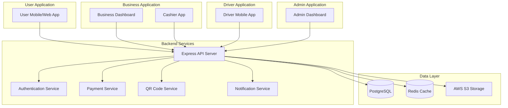

# CSY-Backend - Complete Implementation Documentation

## Table of Contents
1. [Project Overview](#project-overview)
2. [Architecture Overview](#architecture-overview)
3. [Application 1: User Application](#application-1-user-application)
4. [Application 2: Business Application](#application-2-business-application)
5. [Application 3: Driver Application](#application-3-driver-application)
6. [Admin Dashboard](#admin-dashboard)
7. [Shared Systems](#shared-systems)
8. [Database Schema](#database-schema)

---

## Project Overview

**CSY-Backend** is a comprehensive multi-sided marketplace platform backend that connects **Users**, **Businesses**, and **Drivers** through three distinct applications. The system facilitates:
- 🍽️ Food delivery and pickup orders
- 📅 Reservation management for restaurants, cafes, clinics, beauty centers, and recreational facilities
- 💳 Payment processing (cash, online, wallet)
- 🚗 Delivery logistics with driver management
- 📊 Business analytics and management
- 👑 Admin panel for system oversight

**Technology Stack:**
- **Runtime:** Node.js with Express.js
- **Database:** PostgreSQL with Prisma ORM
- **Authentication:** JWT-based authentication
- **Storage:** AWS S3 for media files
- **Caching:** Redis for performance optimization

---

## Architecture Overview

### System Components



### Database Models
- **User Models:** Users, Addresses, Wallets, Points, Subscriptions
- **Business Models:** Businesses, Cashiers, Products, Appointments, CashierOperations
- **Driver Models:** Drivers (with earnings tracking and location)
- **Transaction Models:** Orders, OrderItems, Reservations, Transactions, Payments
- **Supporting Models:** QRCodes, Ratings, Notifications
- **Admin Models:** Admins (with role-based permissions)

---

## Application 1: User Application

The User Application provides end-users with the ability to discover businesses, place orders, make reservations, and manage their account.

### 1.1 Authentication & Authorization

#### **1.1.1 User Registration**
**Endpoint:** `POST /api/auth/register`

**Function:** Creates a new user account with email verification

**Implementation Details:**
- Generates a unique `pass_id` for each user (used as a membership identifier)
- Hashes password using bcrypt
- Creates associated wallet record automatically
- Initializes points balance at 0
- Validates email uniqueness and phone uniqueness
- Sets `is_verified: false` by default

**Request Body:**
```json
{
  "full_name": "John Doe",
  "email": "john@example.com",
  "phone": "+201234567890",
  "password": "securePassword123",
  "governorate_code": "DM"
}
```

**Database Operations:**
1. Check if email/phone already exists
2. Hash password
3. Generate unique `pass_id`
4. Create User record
5. Create associated Wallet record
6. Return JWT token

#### **1.1.2 User Login**
**Endpoint:** `POST /api/auth/login`

**Function:** Authenticates user credentials and returns JWT token

**Implementation:**
- Validates email and password
- Checks if account is active (`is_active: true`)
- Generates JWT token with user ID and role
- Returns user profile data along with token

#### **1.1.3 Password Reset**
**Endpoint:** `POST /api/auth/forgot-password`

**Function:** Initiates password reset flow

**Implementation:**
- Generates password reset token
- Sends email with reset link
- Token expires after 1 hour

#### **1.1.4 Email Verification**
**Endpoint:** `POST /api/auth/verify-email`

**Function:** Verifies user email address

**Implementation:**
- Updates `is_verified` field to true
- May unlock additional features for verified users

---

### 1.2 User Profile Management

#### **1.2.1 Get User Profile**
**Endpoint:** `GET /api/user/profile`

**Function:** Retrieves complete user profile information

**Returns:**
- Personal information (name, email, phone, pass_id, governorate)
- Profile picture URL
- AI assistant name
- Wallet balance
- Points balance
- Account status (is_active, is_verified)
- Recent activity summary

#### **1.2.2 Update User Profile**
**Endpoint:** `PUT /api/user/profile`

**Function:** Updates user profile information

**Updatable Fields:**
- `full_name`
- `phone`
- `profile_picture` (S3 URL)
- `ai_assistant_name`

**Validation:**
- Phone must be unique across all users
- Profile picture must be valid URL
- Full name minimum 2 characters

#### **1.2.3 Change Password**
**Endpoint:** `PUT /api/user/password`

**Function:** Changes user password with verification

**Implementation:**
- Requires current password for verification
- Validates new password strength
- Hashes new password
- Updates password_hash field

#### **1.2.4 Deactivate Account**
**Endpoint:** `DELETE /api/user/deactivate`

**Function:** Deactivates user account (soft delete)

**Implementation:**
- Requires password confirmation
- Sets `is_active: false`
- Does not delete data (soft delete for data retention)
- User can reactivate by contacting support

#### **1.2.5 Update AI Assistant Name**
**Endpoint:** `PUT /api/user/assistant-name`

**Function:** Customizes the name of the AI assistant

**Use Case:** Allows users to personalize their experience with a custom AI assistant name

---

### 1.3 Address Management

#### **1.3.1 Get All Addresses**
**Endpoint:** `GET /api/user/addresses`

**Function:** Retrieves all saved delivery addresses for the user

**Returns:** Array of addresses with:
- Address ID
- Recipient name
- Area, street, city
- Floor/apartment (optional)
- Phone number
- GPS coordinates (latitude, longitude)
- Default address flag

#### **1.3.2 Add New Address**
**Endpoint:** `POST /api/user/addresses`

**Function:** Adds a new delivery address

**Implementation:**
- If `is_default: true`, sets all other addresses to `is_default: false`
- Validates GPS coordinates if provided
- Stores complete address details for delivery

#### **1.3.3 Update Address**
**Endpoint:** `PUT /api/user/addresses/:id`

**Function:** Updates an existing address

**Validation:**
- Address must belong to authenticated user
- Cannot modify another user's address

#### **1.3.4 Delete Address**
**Endpoint:** `DELETE /api/user/addresses/:id`

**Function:** Deletes a delivery address

**Implementation:**
- Cascade delete (removes address completely)
- If default address is deleted, no automatic reassignment

---

### 1.4 Wallet & Points System

#### **1.4.1 Get Wallet Information**
**Endpoint:** `GET /api/user/wallet`

**Function:** Retrieves wallet balance and transaction summary

**Returns:**
- Current balance (in piastres - 1 EGP = 100 piastres)
- Currency (EGP)
- Total amount added to wallet
- Total amount spent from wallet

#### **1.4.2 Add Wallet Balance**
**Endpoint:** `POST /api/user/wallet/add`

**Function:** Add money to user wallet

**Implementation:**
- Minimum topup: 1000 piastres (10 EGP)
- Payment methods: card, mobile_wallet, bank_transfer
- Creates a transaction record
- Updates wallet balance
- Transaction type: `wallet_topup`

#### **1.4.3 Get Wallet Transaction History**
**Endpoint:** `GET /api/user/wallet/history`

**Function:** Retrieves paginated wallet transaction history

**Query Parameters:**
- `page` (default: 1)
- `limit` (default: 20, max: 100)

**Returns:** List of transactions with:
- Transaction ID
- Amount
- Type (payment, refund, wallet_topup)
- Status (pending, completed, failed, refunded)
- Created timestamp

#### **1.4.4 Get Points Balance**
**Endpoint:** `GET /api/user/points`

**Function:** Retrieves loyalty points balance and history

**Returns:**
- Current points balance
- Points earned history
- Points redeemed history
- Activity type (order, reservation, rating, bonus)

#### **1.4.5 Get Points History**
**Endpoint:** `GET /api/user/points/history`

**Function:** Retrieves detailed points transaction history

**Pagination:** Similar to wallet history

---

### 1.5 Order Management

#### **1.5.1 Create Order**
**Endpoint:** `POST /api/orders`

**Function:** Creates a new delivery or pickup order

**Request Body:**
```json
{
  "items": [
    {
      "product_id": "uuid",
      "quantity": 2,
      "add_ons": [
        {"name": "Extra Cheese", "price": 500}
      ]
    }
  ],
  "order_type": "delivery",
  "payment_method": "cash",
  "delivery_address": {
    "street": "123 Main St",
    "city": "Damascus",
    "governorate": "Damascus",
    "latitude": 33.5138,
    "longitude": 36.2765
  },
  "delivery_notes": "Ring the bell twice",
  "coupon_code": "SAVE10"
}
```

**Implementation Process:**
1. Validates all product IDs exist and are available
2. Calculates item prices from product database
3. Applies coupon discount if valid
4. Calculates platform fee (typically 5-10%)
5. Calculates delivery fee based on distance
6. Generates unique order number
7. Creates Order record with status: `pending`
8. Creates OrderItem records for each product
9. If payment_method is 'wallet', deducts from wallet
10. Creates Transaction record
11. Sends notification to business
12. Returns order details with QR code if applicable

**Status Flow:**
`pending` → `accepted` → `preparing` → `waiting_driver` → `in_delivery` → `completed`

#### **1.5.2 Calculate Cart Total**
**Endpoint:** `POST /api/orders/cart`

**Function:** Calculates total cost before order placement

**Implementation:**
- Pre-validates product availability
- Calculates subtotal
- Applies discount from coupon
- Adds platform fee
- Adds delivery fee (if delivery order)
- Returns breakdown without creating order

#### **1.5.3 Get User Orders**
**Endpoint:** `GET /api/orders/user`

**Function:** Retrieves all orders for the user

**Query Parameters:**
- `page`, `limit` for pagination
- `status` filter (pending, completed, cancelled, etc.)
- `order_type` filter (delivery, pickup)

#### **1.5.4 Get Order Details**
**Endpoint:** `GET /api/orders/:id`

**Function:** Retrieves detailed information about a specific order

**Returns:**
- Order number, status, timestamps
- All order items with product details
- Business information
- Driver information (if assigned)
- Delivery address
- Payment details
- Total breakdown

#### **1.5.5 Update Order**
**Endpoint:** `PUT /api/orders/:id`

**Function:** Updates order details (limited to pending/accepted orders)

**Updatable Fields:**
- `delivery_address` (only if status is pending)
- `delivery_notes`

#### **1.5.6 Cancel Order**
**Endpoint:** `DELETE /api/orders/:id`

**Function:** Cancels an order

**Implementation:**
- Only allowed if status is `pending` or `accepted`
- Updates status to `cancelled`
- Refunds payment if already paid
- Creates refund transaction
- Notifies business and driver (if assigned)

#### **1.5.7 Track Order**
**Endpoint:** `GET /api/orders/track/:id`

**Function:** Real-time order tracking

**Returns:**
- Current order status
- Driver location (latitude, longitude) if in_delivery
- Estimated delivery time
- Route information

---

### 1.6 Reservation Management

#### **1.6.1 Create Reservation**
**Endpoint:** `POST /api/reservations`

**Function:** Books a reservation at a business

**Request Body:**
```json
{
  "business_id": "uuid",
  "reservation_type": "table",
  "date": "2024-01-20",
  "time": "19:30",
  "duration": 120,
  "number_of_people": 4,
  "payment_method": "online",
  "notes": "Window seat preferred",
  "specialty": "Cardiology"
}
```

**Reservation Types:**
- `table` - Restaurant/cafe table reservation
- `activity` - Recreational activity booking
- `medical` - Medical appointment
- `beauty` - Beauty salon appointment

**Implementation:**
1. Checks business availability for date/time
2. Validates business accepts reservations
3. Generates unique QR code for reservation
4. Creates Reservation record with status: `pending`
5. Creates Transaction if payment required
6. Sends notification to business
7. Awards points to user
8. Returns reservation details with QR code

#### **1.6.2 Get User Reservations**
**Endpoint:** `GET /api/reservations`

**Function:** Retrieves all reservations for the user

**Query Parameters:**
- `page`, `limit` for pagination
- `status` filter (pending, confirmed, cancelled, completed)
- `upcoming=true` - shows only future reservations

#### **1.6.3 Get Reservation Details**
**Endpoint:** `GET /api/reservations/:id`

**Function:** Retrieves detailed information about a reservation

**Returns:**
- Reservation details
- Business information
- QR code
- Payment status
- Rating (if completed and rated)

#### **1.6.4 Update Reservation**
**Endpoint:** `PUT /api/reservations/:id`

**Function:** Updates reservation details

**Updatable Fields:**
- `time` (must be at least 2 hours in advance)
- `duration`
- `number_of_people`
- `notes`

**Restrictions:**
- Cannot update if status is `cancelled` or `completed`
- Cannot update if reservation is within 2 hours

#### **1.6.5 Cancel Reservation**
**Endpoint:** `DELETE /api/reservations/:id/cancel`

**Function:** Cancels a reservation

**Implementation:**
- Updates status to `cancelled`
- Determines refund eligibility based on cancellation policy
- Creates refund transaction if eligible
- Notifies business
- Optional: accepts cancellation reason

#### **1.6.6 Check Availability**
**Endpoint:** `GET /api/reservations/availability`

**Function:** Gets available time slots for a business

**Query Parameters:**
- `businessId` (required)
- `date` (required, YYYY-MM-DD)
- `duration` (default: 60 minutes)

**Returns:** Array of available time slots in HH:MM format

#### **1.6.7 Rate Reservation**
**Endpoint:** `POST /api/reservations/:id/rate`

**Function:** Submits rating and review for completed reservation

**Request Body:**
```json
{
  "stars": 5,
  "comment": "Excellent service and great food!"
}
```

**Implementation:**
- Only allowed for `completed` reservations
- Stars: 1-5
- Updates business rating average
- Awards bonus points to user for reviewing
- Creates Rating record

---

### 1.7 QR Code Features

#### **1.7.1 Generate QR Code**
**Endpoint:** `POST /api/qr/generate`

**Function:** Generates QR codes for discounts, payments, reservations, orders

**QR Types:**
- `discount` - For discount redemption at business
- `payment` - For payment processing
- `reservation` - For reservation check-in
- `order` - For order pickup/delivery confirmation
- `driver_pickup` - For driver to confirm pickup at business

**Implementation:**
- Generates unique QR token
- Stores QR metadata in database
- Sets expiration time (typically 15-30 minutes)
- Returns QR code as data URL (image)

#### **1.7.2 Validate QR Code**
**Endpoint:** `POST /api/qr/validate`

**Function:** Validates if a QR code is valid and not expired

**Returns:**
- `is_valid`: boolean
- QR data if valid
- Expiration timestamp
- QR type

#### **1.7.3 Scan QR Code**
**Endpoint:** `POST /api/qr/scan`

**Function:** Scans and processes a QR code

**Actions:**
- `process` - Generic processing
- `redeem` - Redeem discount
- `confirm_pickup` - Confirm order pickup

**Implementation:**
- Validates QR code
- Performs associated action
- Marks QR as used
- Creates relevant transaction/operation record

---

### 1.8 Ratings & Reviews

#### **1.8.1 Rate Business**
**Endpoint:** `POST /api/ratings/business/:businessId`

**Function:** Submits rating for a business

**Implementation:**
- Validates user has completed order/reservation at business
- Creates Rating record
- Updates business `rating_average` and `rating_count`
- Awards points to user

#### **1.8.2 Rate Driver**
**Endpoint:** `POST /api/ratings/driver/:driverId`

**Function:** Submits rating for a driver

**Implementation:**
- Validates user had order delivered by this driver
- Creates Rating record
- Updates driver `rating_average` and `rating_count`

#### **1.8.3 Get User Ratings**
**Endpoint:** `GET /api/ratings/user`

**Function:** Retrieves all ratings submitted by user

---

### 1.9 Subscription Management

#### **1.9.1 Get User Subscriptions**
**Endpoint:** `GET /api/user/subscriptions`

**Function:** Retrieves active subscriptions

**Subscription Types (app_type):**
- `pass` - Restaurant/Food delivery subscription
- `care` - Healthcare/Beauty subscription
- `go` - Delivery-only subscription
- `pass_go` - Combined food + delivery
- `care_go` - Combined care + delivery

**Benefits:**
- Discount eligibility on orders/reservations
- Priority booking
- Free delivery (depending on plan)

---

## Application 2: Business Application

The Business Application allows business owners and cashiers to manage their business operations, accept orders, handle reservations, and track performance.

### 2.1 Business Authentication

#### **2.1.1 Business Registration**
**Endpoint:** `POST /api/business/register`

**Function:** Registers a new business on the platform

**Request Body:**
```json
{
  "owner_email": "owner@restaurant.com",
  "password_hash": "securePassword123",
  "business_name": "Delicious Restaurant",
  "business_type": "restaurant",
  "app_type": "pass",
  "address": "123 Main Street",
  "city": "Damascus",
  "governorate": "Damascus",
  "latitude": 33.5138,
  "longitude": 36.2765,
  "has_reservations": true,
  "has_delivery": true
}
```

**Business Types:**
- `restaurant`, `cafe`, `pharmacy`, `clinic`, `beauty_center`, `juice_shop`, `dessert_shop`, `fast_food`, `supermarket`, `recreational`, `other`

**Implementation:**
1. Validates email uniqueness
2. Hashes password
3. Creates Business record
4. Sets `is_active: true` by default (may require admin approval)
5. Returns JWT token for business authentication

#### **2.1.2 Business Login**
**Endpoint:** `POST /api/business/login`

**Function:** Authenticates business owner

**Implementation:**
- Validates email and password
- Checks if business is active
- Returns business profile and JWT token

---

### 2.2 Business Profile Management

#### **2.2.1 Get Business Profile**
**Endpoint:** `GET /api/business/profile`

**Function:** Retrieves complete business profile and statistics

**Returns:**
- Business information
- Working hours
- Photos and videos
- Rating average and count
- Statistics:
  - Total products
  - Total orders
  - Total reservations
  - Ratings summary

#### **2.2.2 Update Business Profile**
**Endpoint:** `PUT /api/business/profile`

**Function:** Updates business information

**Updatable Fields:**
- `business_name`
- `address`, `city`, `governorate`
- `latitude`, `longitude`
- `working_hours` (JSON object)
- `photos` array
- `videos` array
- `has_reservations` flag
- `has_delivery` flag

#### **2.2.3 Update Working Hours**
**Endpoint:** `PUT /api/business/working-hours`

**Function:** Updates business operating hours

**Request Body:**
```json
{
  "working_hours": {
    "monday": "9:00-22:00",
    "tuesday": "9:00-22:00",
    "wednesday": "9:00-22:00",
    "thursday": "9:00-22:00",
    "friday": "9:00-22:00",
    "saturday": "10:00-20:00",
    "sunday": "closed"
  }
}
```

#### **2.2.4 Upload Business Photos**
**Endpoint:** `POST /api/business/photos`

**Function:** Uploads business photos to S3

**Implementation:**
- Uploads images to AWS S3
- Returns S3 URLs
- Appends URLs to photos array

#### **2.2.5 Delete Business Photo**
**Endpoint:** `DELETE /api/business/photos/:id`

**Function:** Deletes a photo by index

**Implementation:**
- Removes photo from array by index
- Optionally deletes from S3

---

### 2.3 Product/Menu Management

#### **2.3.1 Create Product**
**Endpoint:** `POST /api/business/products`

**Function:** Adds a new product/menu item

**Request Body:**
```json
{
  "name": "Margherita Pizza",
  "description": "Classic pizza with tomato and mozzarella",
  "ingredients": "Tomato sauce, mozzarella cheese, basil",
  "price": 12000,
  "weight": "450g",
  "category": "Pizza",
  "image_url": "https://s3.amazonaws.com/...",
  "is_available": true
}
```

#### **2.3.2 Get All Products**
**Endpoint:** `GET /api/business/products`

**Function:** Retrieves all products for the business

**Query Parameters:**
- `page`, `limit` for pagination
- `category` filter
- `is_available` filter

#### **2.3.3 Update Product**
**Endpoint:** `PUT /api/business/products/:id`

**Function:** Updates product information

**Updatable Fields:**
- `name`, `description`, `ingredients`
- `price`
- `weight`, `category`
- `image_url`
- `is_available` (to disable product)

#### **2.3.4 Delete Product**
**Endpoint:** `DELETE /api/business/products/:id`

**Function:** Deletes a product

**Implementation:**
- Soft delete (sets `is_available: false`) or hard delete
- Prevents deletion if product is in active orders

---

### 2.4 Order Management

#### **2.4.1 Get Business Orders**
**Endpoint:** `GET /api/business/orders`

**Function:** Retrieves all orders for the business

**Query Parameters:**
- `page`, `limit`
- `status` filter
- `order_type` filter (delivery, pickup)
- `date_from`, `date_to` for date range

#### **2.4.2 Get Order Details**
**Endpoint:** `GET /api/business/orders/:id`

**Function:** Retrieves detailed information about an order

#### **2.4.3 Accept Order**
**Endpoint:** `PUT /api/business/orders/:id/accept`

**Function:** Accepts a pending order

**Implementation:**
1. Updates order status from `pending` to `accepted`
2. Sends notification to user
3. Starts preparation timer

#### **2.4.4 Reject Order**
**Endpoint:** `PUT /api/business/orders/:id/reject`

**Function:** Rejects a pending order

**Request Body:**
```json
{
  "reason": "Item out of stock"
}
```

**Implementation:**
1. Updates order status to `cancelled`
2. Refunds payment if already processed
3. Sends notification to user with reason

#### **2.4.5 Mark as Ready for Pickup**
**Endpoint:** `PUT /api/business/orders/:id/ready`

**Function:** Marks order as ready for pickup/delivery

**Implementation:**
- Updates status to `waiting_driver` (for delivery) or `ready_for_pickup`
- Notifies user
- Notifies nearby drivers if delivery order

#### **2.4.6 Complete Order**
**Endpoint:** `PUT /api/business/orders/:id/complete`

**Function:** Marks order as completed

**Implementation:**
- Only for pickup orders
- Updates status to `completed`
- Triggers payment settlement to business

---

### 2.5 Cashier Management

#### **2.5.1 Create Cashier Account**
**Endpoint:** `POST /api/business/cashiers`

**Function:** Creates a new cashier account

**Request Body:**
```json
{
  "email": "cashier@restaurant.com",
  "full_name": "Ahmed Ali",
  "password_hash": "cashierPassword123"
}
```

**Implementation:**
- Creates Cashier record linked to business
- Cashier can log in and perform limited operations
- Cannot access business financial data

#### **2.5.2 Get All Cashiers**
**Endpoint:** `GET /api/business/cashiers`

**Function:** Retrieves all cashiers for the business

**Pagination:** Supports page & limit parameters

#### **2.5.3 Update Cashier**
**Endpoint:** `PUT /api/business/cashiers/:id`

**Function:** Updates cashier information

**Updatable Fields:**
- `full_name`
- `is_active` (to disable cashier account)

#### **2.5.4 Delete Cashier**
**Endpoint:** `DELETE /api/business/cashiers/:id`

**Function:** Deletes a cashier account

**Implementation:**
- Cascade delete
- All cashier operations remain in history

---

### 2.6 Reservation Management (Business Side)

#### **2.6.1 Get Business Reservations**
**Endpoint:** `GET /api/business/reservations`

**Function:** Retrieves all reservations for the business

**Query Parameters:**
- `page`, `limit`
- `status` filter
- `date` filter
- `reservation_type` filter

#### **2.6.2 Accept/Confirm Reservation**
**Endpoint:** `PUT /api/business/reservations/:id/confirm`

**Function:** Confirms a pending reservation

**Implementation:**
- Updates status from `pending` to `confirmed`
- Sends confirmation notification to user

#### **2.6.3 Cancel Reservation**
**Endpoint:** `DELETE /api/business/reservations/:id/cancel`

**Function:** Cancels a reservation (business side)

**Request Body:**
```json
{
  "reason": "Fully booked / Emergency closure"
}
```

**Implementation:**
- Updates status to `cancelled`
- Processes refund
- Sends notification to user

#### **2.6.4 Mark Reservation as Completed**
**Endpoint:** `PUT /api/business/reservations/:id/complete`

**Function:** Marks reservation as completed after customer visit

---

### 2.7 Appointment Management (Healthcare/Beauty)

#### **2.7.1 Create Appointment Slot**
**Endpoint:** `POST /api/business/appointments`

**Function:** Creates available appointment slots

**Request Body:**
```json
{
  "service_name": "Dental Checkup",
  "description": "Regular dental examination",
  "date": "2024-01-20",
  "time": "10:00",
  "duration": 30,
  "price": 50000
}
```

**Use Case:** For clinics and beauty centers to define bookable slots

#### **2.7.2 Get Appointments**
**Endpoint:** `GET /api/business/appointments`

**Function:** Retrieves all appointment slots

#### **2.7.3 Update Appointment**
**Endpoint:** `PUT /api/business/appointments/:id`

**Function:** Updates appointment slot details

#### **2.7.4 Delete Appointment**
**Endpoint:** `DELETE /api/business/appointments/:id`

**Function:** Deletes an appointment slot

---

### 2.8 Cashier Operations Tracking

All cashier operations are recorded in the `CashierOperation` model for audit purposes:

**Operation Types:**
- `discount` - Applied discount at checkout
- `payment` - Processed payment
- `qr_scan` - Scanned user QR code
- `reservation_confirm` - Confirmed reservation check-in

**Automatic Logging:** Every action by cashier creates an operation record with:
- Cashier ID
- Business ID
- Operation type
- Amount (if applicable)
- Discount amount (if applicable)
- Reference ID (order, reservation, transaction)
- Metadata (additional context)
- Timestamp

---

### 2.9 Business Analytics

#### **2.9.1 Get Business Analytics**
**Endpoint:** `GET /api/business/analytics`

**Function:** Retrieves business performance metrics

**Query Parameters:**
- `period` (today, week, month, year, custom)
- `start_date`, `end_date` (for custom period)

**Returns:**
```json
{
  "revenue": {
    "total": 1500000,
    "cash": 800000,
    "online": 700000
  },
  "orders": {
    "total": 245,
    "completed": 230,
    "cancelled": 15
  },
  "reservations": {
    "total": 78,
    "confirmed": 75,
    "no_show": 3
  },
  "top_products": [
    {"name": "Pizza Margherita", "quantity": 45, "revenue": 540000}
  ],
  "ratings": {
    "average": 4.5,
    "total_count": 189
  }
}
```

---

## Application 3: Driver Application

The Driver Application enables delivery drivers to accept orders, track deliveries, update locations, and manage earnings.

### 3.1 Driver Authentication

#### **3.1.1 Driver Registration**
**Endpoint:** `POST /api/driver/register`

**Function:** Registers a new driver on the platform

**Request Body:**
```json
{
  "full_name": "Ahmed Mohamed",
  "email": "ahmed@example.com",
  "phone": "+201234567890",
  "vehicle_type": "motorcycle",
  "password_hash": "securePassword123"
}
```

**Vehicle Types:** car, motorcycle, bicycle, scooter

**Implementation:**
1. Validates email and phone uniqueness
2. Hashes password
3. Creates Driver record
4. Sets initial earnings to 0
5. Sets `is_available: false` (driver must manually go online)
6. Returns JWT token

#### **3.1.2 Driver Login**
**Endpoint:** `POST /api/driver/login`

**Function:** Authenticates driver account

**Implementation:**
- Validates credentials
- Checks if account is active
- Returns driver profile and JWT token

---

### 3.2 Driver Profile Management

#### **3.2.1 Get Driver Profile**
**Endpoint:** `GET /api/driver/profile`

**Function:** Retrieves complete driver profile and current status

**Returns:**
- Personal information
- Vehicle type
- Profile picture
- Earnings breakdown:
  - `earnings_cash` - Cash collected from deliveries
  - `earnings_online` - Online payment earnings
  - `platform_fees_owed` - Fees owed to platform
- Current GPS location
- Availability status
- Rating average and count
- Statistics:
  - Active orders count
  - Completed orders today
  - Total deliveries

#### **3.2.2 Update Driver Profile**
**Endpoint:** `PUT /api/driver/profile`

**Function:** Updates driver information

**Updatable Fields:**
- `full_name`
- `phone`
- `vehicle_type`
- `profile_picture`

---

### 3.3 Location & Availability Management

#### **3.3.1 Update Driver Location**
**Endpoint:** `PUT /api/driver/location`

**Function:** Updates driver's current GPS location

**Request Body:**
```json
{
  "latitude": 33.5138,
  "longitude": 36.2765
}
```

**Implementation:**
- Used for real-time tracking
- Should be called every 10-30 seconds while driver is online
- Updates `current_latitude` and `current_longitude` fields

#### **3.3.2 Update Availability Status**
**Endpoint:** `PUT /api/driver/availability`

**Function:** Sets driver online/offline

**Request Body:**
```json
{
  "is_available": true
}
```

**Implementation:**
- When `is_available: true`, driver receives order notifications
- When `is_available: false`, driver is invisible to order matching

---

### 3.4 Order Management (Driver Side)

#### **3.4.1 Get Incoming Orders**
**Endpoint:** `GET /api/driver/orders/incoming`

**Function:** Retrieves available orders near driver's location

**Query Parameters:**
- `page`, `limit` for pagination
- `latitude`, `longitude` (optional, uses driver's stored location if not provided)

**Returns:** Orders with status `waiting_driver` sorted by distance

**Implementation:**
- Calculates distance from driver's location to business
- Only shows orders within a certain radius (e.g., 10km)
- Prioritizes closer orders

#### **3.4.2 Get Accepted Orders**
**Endpoint:** `GET /api/driver/orders/accepted`

**Function:** Retrieves orders accepted by driver (status: `preparing`)

**Use Case:** Driver is waiting for business to prepare the order

#### **3.4.3 Get Orders In Delivery**
**Endpoint:** `GET /api/driver/orders/in-delivery`

**Function:** Retrieves orders currently being delivered

**Returns:** Orders with status `in_delivery`

#### **3.4.4 Get All Driver Orders**
**Endpoint:** `GET /api/driver/orders`

**Function:** Retrieves driver's complete order history

**Query Parameters:**
- `page`, `limit`
- `status` filter

#### **3.4.5 Accept Order Assignment**
**Endpoint:** `POST /api/driver/orders/:id/accept`

**Function:** Driver accepts an order for delivery

**Implementation:**
1. Validates order is `waiting_driver` status
2. Validates driver is available
3. Assigns driver to order
4. Updates order status to `in_delivery`
5. Sends notification to user with driver details
6. Starts delivery tracking

#### **3.4.6 Mark Order as Delivered**
**Endpoint:** `POST /api/driver/orders/:id/deliver`

**Function:** Marks order as successfully delivered

**Implementation:**
1. Validates order is `in_delivery` status
2. Updates order status to `completed`
3. Updates driver earnings:
   - If `payment_method: cash`, adds to `earnings_cash`
   - If `payment_method: online`, adds to `earnings_online`
4. Calculates and adds platform fee to `platform_fees_owed`
5. Sends completion notification to user
6. Prompts user to rate driver

---

### 3.5 Earnings & Payments

#### **3.5.1 Get Driver Earnings**
**Endpoint:** `GET /api/driver/earnings`

**Function:** Retrieves earnings statistics

**Query Parameters:**
- `startDate`, `endDate` for date range filtering

**Returns:**
```json
{
  "total_earnings": 250000,
  "earnings_cash": 150000,
  "earnings_online": 100000,
  "platform_fees_owed": 25000,
  "net_earnings": 225000,
  "deliveries_count": 87,
  "average_per_delivery": 2874,
  "breakdown_by_day": [
    {"date": "2024-01-15", "earnings": 35000, "deliveries": 12}
  ]
}
```

#### **3.5.2 Request Payout**
**Endpoint:** `POST /api/driver/earnings/payout`

**Function:** Requests payout of earnings

**Implementation:**
- Verifies sufficient balance
- Creates payout request
- Admin approves and processes
- Deducts platform fees

---

### 3.6 Driver Ratings

Drivers are rated by users after delivery completion.

**Rating Calculation:**
- Average of all ratings (1-5 stars)
- Displayed on driver profile
- Affects order matching priority (higher-rated drivers get priority)

---

## Admin Dashboard

The Admin Dashboard provides system oversight, user/business/driver management, and analytics.

### 4.1 Admin Authentication

#### **4.1.1 Admin Login**
**Endpoint:** `POST /api/admin/login`

**Function:** Authenticates admin user

**Admin Roles:**
- `super_admin` - Full system access
- `finance_admin` - Financial & transaction access
- `support_admin` - User/business support access
- `content_admin` - Content moderation access

#### **4.1.2 Get Admin Profile**
**Endpoint:** `GET /api/admin/me`

**Function:** Retrieves current admin profile

#### **4.1.3 Update Admin Password**
**Endpoint:** `PATCH /api/admin/update-password`

**Function:** Changes admin password

#### **4.1.4 Update Admin Status**
**Endpoint:** `PATCH /api/admin/update-activestatus`

**Function:** Activates/deactivates admin account

---

### 4.2 Dashboard Overview

#### **4.2.1 Get Dashboard Statistics**
**Endpoint:** `GET /api/admin/dashboard/stats`

**Function:** Retrieves high-level system statistics

**Returns:**
```json
{
  "users": {
    "total": 5420,
    "active": 4987,
    "new_this_month": 342
  },
  "businesses": {
    "total": 234,
    "active": 221,
    "pending_approval": 5
  },
  "drivers": {
    "total": 156,
    "online": 78,
    "active": 145
  },
  "orders": {
    "total": 12456,
    "today": 145,
    "pending": 23,
    "in_delivery": 34
  },
  "reservations": {
    "total": 3245,
    "today": 45,
    "pending": 12
  },
  "revenue": {
    "total": 15600000,
    "this_month": 2340000,
    "platform_fees": 780000
  }
}
```

#### **4.2.2 Get Revenue Chart Data**
**Endpoint:** `GET /api/admin/dashboard/revenue-chart`

**Function:** Retrieves revenue data for charting

**Query Parameters:**
- `period` (week, month, year)

**Returns:** Time-series revenue data

#### **4.2.3 Get User Growth Data**
**Endpoint:** `GET /api/admin/dashboard/user-growth`

**Function:** Retrieves user registration growth data

**Returns:** Time-series user growth statistics

---

### 4.3 User Management

#### **4.3.1 Get All Users**
**Endpoint:** `GET /api/admin/users`

**Function:** Retrieves all users with filtering and pagination

**Query Parameters:**
- `page`, `limit`
- `search` (name, email, phone)
- `governorate` filter
- `is_active` filter
- `is_verified` filter

**Required Role:** `super_admin`, `support_admin`

#### **4.3.2 Get User Details**
**Endpoint:** `GET /api/admin/users/:id`

**Function:** Retrieves detailed user information

**Returns:**
- Complete user profile
- Wallet and points balance
- Order history summary
- Reservation history summary
- Recent transactions

**Required Role:** `super_admin`, `support_admin`

#### **4.3.3 Update User Status**
**Endpoint:** `PATCH /api/admin/users/:id/status`

**Function:** Activates/deactivates user account

**Request Body:**
```json
{
  "is_active": false,
  "reason": "Violation of terms of service"
}
```

**Required Role:** `super_admin`

#### **4.3.4 Delete User**
**Endpoint:** `DELETE /api/admin/users/:id`

**Function:** Soft deletes a user account

**Implementation:**
- Sets `is_active: false`
- Anonymizes personal data (GDPR compliance option)
- Retains transaction history for auditing

**Required Role:** `super_admin`

---

### 4.4 Business Management

#### **4.4.1 Get All Businesses**
**Endpoint:** `GET /api/admin/businesses`

**Function:** Retrieves all businesses with filtering

**Query Parameters:**
- `page`, `limit`
- `search` (name, email)
- `business_type` filter
- `city`, `governorate` filter
- `is_active` filter

**Required Role:** `super_admin`, `support_admin`

#### **4.4.2 Get Business Details**
**Endpoint:** `GET /api/admin/businesses/:id`

**Function:** Retrieves detailed business information

**Returns:**
- Complete business profile
- Orders summary
- Reservations summary
- Revenue statistics
- Rating summary

**Required Role:** `super_admin`, `support_admin`

#### **4.4.3 Update Business Status**
**Endpoint:** `PATCH /api/admin/businesses/:id/status`

**Function:** Approves/rejects/suspends business

**Request Body:**
```json
{
  "is_active": true,
  "reason": "Approved after verification"
}
```

**Use Cases:**
- Approve new business registration
- Suspend business for policy violation
- Reactivate suspended business

**Required Role:** `super_admin`

#### **4.4.4 Delete Business**
**Endpoint:** `DELETE /api/admin/businesses/:id`

**Function:** Soft deletes a business

**Required Role:** `super_admin`

---

### 4.5 Driver Management

#### **4.5.1 Get All Drivers**
**Endpoint:** `GET /api/admin/drivers`

**Function:** Retrieves all drivers with filtering

**Query Parameters:**
- `page`, `limit`
- `search` (name, email, phone)
- `vehicle_type` filter
- `is_active` filter
- `is_available` filter (currently online)

**Required Role:** `super_admin`, `support_admin`

#### **4.5.2 Get Driver Details**
**Endpoint:** `GET /api/admin/drivers/:id`

**Function:** Retrieves detailed driver information

**Returns:**
- Complete driver profile
- Earnings breakdown
- Delivery history
- Rating summary
- Current location (if online)

**Required Role:** `super_admin`, `support_admin`

#### **4.5.3 Update Driver Status**
**Endpoint:** `PATCH /api/admin/drivers/:id/status`

**Function:** Approves/suspends driver account

**Request Body:**
```json
{
  "is_active": false,
  "reason": "Multiple customer complaints"
}
```

**Required Role:** `super_admin`

---

### 4.6 Transaction Management

#### **4.6.1 Get All Transactions**
**Endpoint:** `GET /api/admin/transactions`

**Function:** Retrieves all financial transactions

**Query Parameters:**
- `page`, `limit`
- `transaction_type` filter (payment, refund, wallet_topup, etc.)
- `status` filter (pending, completed, failed, refunded)
- `payment_method` filter
- `date_from`, `date_to`
- `user_id`, `business_id`, `driver_id` filters

**Required Role:** `super_admin`, `support_admin`

#### **4.6.2 Get Transaction Details**
**Endpoint:** `GET /api/admin/transactions/:id`

**Function:** Retrieves detailed transaction information

**Returns:**
- Transaction details
- Associated user/business/driver
- Order/reservation reference
- Payment method details
- Status history

**Required Role:** `super_admin`, `support_admin`

---

### 4.7 Subscription Management

#### **4.7.1 Get All Subscriptions**
**Endpoint:** `GET /api/admin/subscriptions`

**Function:** Retrieves all user subscriptions

**Query Parameters:**
- `page`, `limit`
- `app_type` filter
- `is_active` filter
- `expiring_soon` (subscriptions expiring in next 7 days)

**Required Role:** `super_admin`

---

### 4.8 System Health

#### **4.8.1 Get System Health**
**Endpoint:** `GET /api/admin/system/health`

**Function:** Checks system health status (Public endpoint)

**Returns:**
```json
{
  "status": "healthy",
  "database": "connected",
  "redis": "connected",
  "s3": "accessible",
  "uptime": 345678,
  "memory_usage": "45%",
  "cpu_usage": "32%"
}
```

---

## Shared Systems

### 5.1 Payment System

**Supported Payment Methods:**
- `cash` - Cash on delivery/pickup
- `online` - Online payment gateway
- `wallet` - User wallet balance

**Payment Flow:**
1. User initiates payment
2. System validates payment method
3. For wallet: Checks sufficient balance
4. For online: Integrates with payment gateway
5. Creates Transaction record
6. Updates relevant balances
7. Sends confirmation

**Transaction Statuses:**
- `pending` - Payment initiated
- `completed` - Payment successful
- `failed` - Payment failed
- `refunded` - Payment refunded

### 5.2 Notification System

**Notification Types:**
- `booking` - Reservation confirmations/cancellations
- `order` - Order status updates
- `payment` - Payment confirmations/failures
- `system` - System announcements
- `promotional` - Marketing messages

**Delivery Channels:**
- In-app notifications
- Email notifications
- SMS notifications (for critical updates)
- Push notifications (mobile apps)

**Implementation:**
- All notifications stored in `Notification` model
- Marked as read/unread
- Retrieved with `GET /api/notifications` endpoint

### 5.3 Rating System

**Rating Mechanism:**
- Users can rate businesses (1-5 stars)
- Users can rate drivers (1-5 stars)
- Ratings linked to completed orders/reservations
- Prevents duplicate ratings

**Rating Impact:**
- Business/Driver `rating_average` updated in real-time
- Rating count tracked
- Ratings influence search ranking and visibility

### 5.4 Points & Rewards System

**Point Earning:**
- Order completion: 10-50 points based on amount
- Reservation completion: 20 points
- Rating submission: 5 bonus points
- Referral bonus: 100 points

**Point Redemption:**
- Can be used as discount on future orders
- 100 points = 1 EGP discount (configurable)

---

## Database Schema

### Core Entities

#### **Users Table**
```prisma
model User {
  id                String
  full_name         String
  email             String @unique
  phone             String @unique
  password_hash     String
  pass_id           String @unique
  governorate_code  GovernorateCode
  profile_picture   String?
  ai_assistant_name String?
  wallet_balance    Decimal
  points            Int
  is_active         Boolean
  is_verified       Boolean
  created_at        DateTime
  updated_at        DateTime
}
```

#### **Business Table**
```prisma
model Business {
  id               String
  owner_email      String @unique
  password_hash    String
  business_name    String
  business_type    BusinessType
  app_type         AppType
  address          String
  city             String
  governorate      String
  latitude         Decimal
  longitude        Decimal
  working_hours    Json?
  photos           String[]
  videos           String[]
  rating_average   Decimal
  rating_count     Int
  has_reservations Boolean
  has_delivery     Boolean
  is_active        Boolean
  created_at       DateTime
  updated_at       DateTime
}
```

#### **Driver Table**
```prisma
model Driver {
  id                 String
  full_name          String
  email              String @unique
  phone              String @unique
  password_hash      String
  vehicle_type       String
  profile_picture    String?
  earnings_cash      Decimal
  earnings_online    Decimal
  platform_fees_owed Decimal
  current_latitude   Decimal?
  current_longitude  Decimal?
  is_available       Boolean
  is_active          Boolean
  rating_average     Decimal
  rating_count       Int
  created_at         DateTime
  updated_at         DateTime
}
```

#### **Order Table**
```prisma
model Order {
  id               String
  order_number     String @unique
  user_id          String
  driver_id        String?
  address_id       String?
  order_type       OrderType
  payment_method   PaymentMethod
  payment_status   PaymentStatus
  status           OrderStatus
  delivery_address Json?
  total_amount     Decimal
  discount_amount  Decimal
  platform_fee     Decimal
  delivery_fee     Decimal
  final_amount     Decimal
  qr_code          String?
  created_at       DateTime
  updated_at       DateTime
}
```

#### **Reservation Table**
```prisma
model Reservation {
  id               String
  user_id          String
  business_id      String
  reservation_type ReservationType
  specialty        String?
  date             DateTime
  time             String
  duration         Int
  number_of_people Int
  payment_method   PaymentMethod
  payment_status   PaymentStatus
  status           ReservationStatus
  qr_code          String @unique
  notes            String?
  created_at       DateTime
  updated_at       DateTime
}
```

---

## API Summary

### Total Endpoints by Application

**User Application:** 40+ endpoints
- Authentication: 5
- Profile management: 8
- Address management: 4
- Wallet & Points: 6
- Orders: 7
- Reservations: 7
- QR Codes: 3
- Ratings: 3
- Subscriptions: 2

**Business Application:** 35+ endpoints
- Authentication: 2
- Profile management: 5
- Product management: 4
- Order management: 6
- Cashier management: 4
- Reservation management: 4
- Appointment management: 4
- Analytics: 1

**Driver Application:** 20+ endpoints
- Authentication: 2
- Profile management: 2
- Location & availability: 2
- Order management: 7
- Earnings: 2
- Ratings: 1

**Admin Dashboard:** 20+ endpoints
- Authentication: 4
- Dashboard: 3
- User management: 4
- Business management: 4
- Driver management: 3
- Transactions: 2
- Subscriptions: 1
- System health: 1

---

## Conclusion

This documentation provides a comprehensive overview of all three applications in the CSY-Backend system. Each function has been detailed with its purpose, implementation, request/response formats, and business logic. The system is designed to handle a complete marketplace ecosystem with robust features for users, businesses, and drivers, all managed through a powerful admin dashboard.

**Key Technologies:**
- Node.js + Express.js
- PostgreSQL + Prisma ORM
- JWT Authentication
- AWS S3 Storage
- Redis Caching

**Next Steps:**
- Deploy to production environment
- Set up monitoring and logging
- Implement comprehensive testing
- Create API documentation with Swagger
- Develop frontend applications

---

**Document Version:** 1.0  
**Date:** December 2024  
**Author:** CSY Backend Development Team
